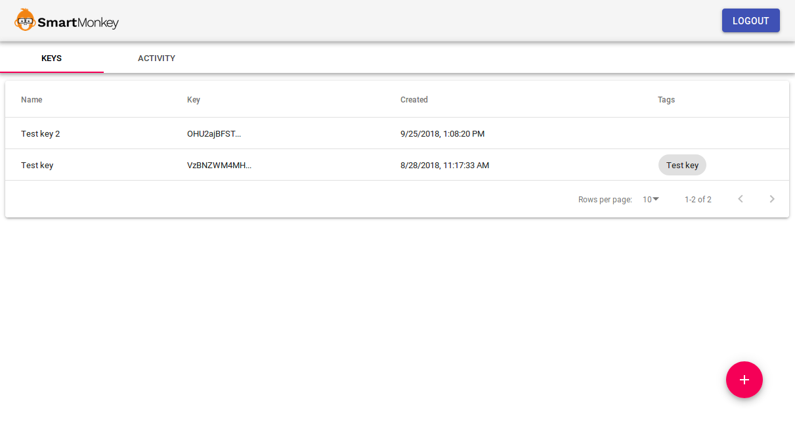

# Getting started
In this section we describe the first steps necessary to start using SmartMonkey's API:

## Sign up
Go to [console.smartmonkey.io](https://console.smartmonkey.io) and select `CREATE ACCOUNT` option in the top right of the screen. Enter personal details and validate your email address.

## Create a new API key
1. Login at [console.smartmonkey.io](https://console.smartmonkey.io).
2. Click the round shaped _plus_ button to add a key.

3. Enter _name_ and _tags_.
