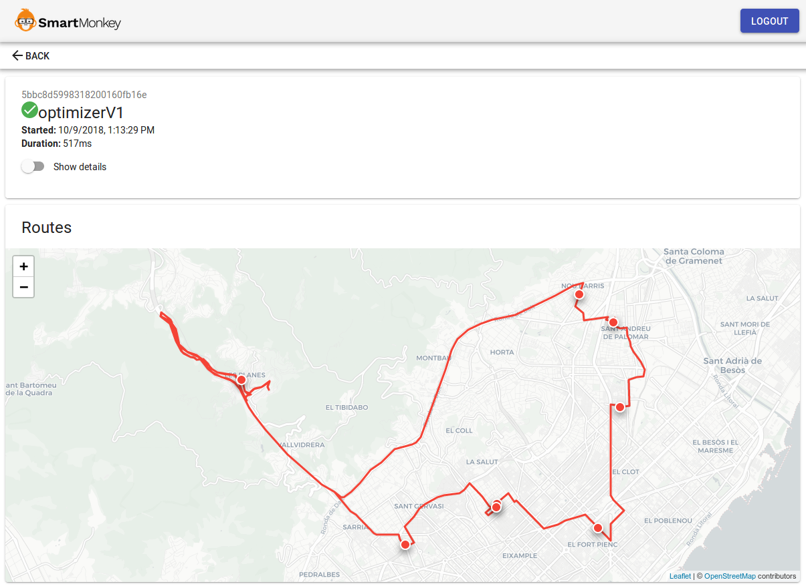

# Route Optimization API

## Getting Started

To use **SmartMonkey's Route Optimization API** you'll require to:
1. Sign up at [SmartMonkey's Flake](https://flake.smartmonkey.io)
2. Create an API key.

## Endpoint

All optimization requests should be addressed to the following endpoint:

> POST https://services.smartmonkey.io/api/v1/optimize?key=API_KEY_HERE

## Input

The input of an optimization request consists of:
1. Vehicles definition
2. Services definition
3. Reward regions
4. Options
5. Configuration

### Input format
The input is structured in 4 main blocks:
* **Vehicles**: vehicles have to visit different places on the map to perform services.
* **Services**: jobs that have to be done by vehicles.
* **Reward zones**: regions in which services have a modified reward.
* **Configuration**: Setup of the optimization call

The input data should be in JSON format in the following way:
```json
{
  "vehicles": [ // Define the vehicles
    {
      "capacity": [84, 71],
      "timewindow": [32400, 57600],
      "start": {
        "lat": 41.374752,
        "lng": 2.14145
      },
      "provides": ["coke", "beer", "sprite"],
      "end": {
        "lat": 41.374752,
        "lng": 2.14145
      },
      "id": "v97499"
    }
  ],
  "services": [ // Define the services
    {
      "requires": ["beer"],
      "timewindows": [[28800, 61200]],
      "location": {
        "lat": 41.376458,
        "lng": 2.128609
      },
      "duration": 1800,
      "reward": 100,
      "optional": true,
      "id": "s2557",
      "size": [7, 5]
    }
  ]
}
```

### Vehicles

A vehicle is defined as follows:

```json
{
  "id": "seller 1",
  "start": {
    "lat": 1.234,
    "lng": 4.324
  },
  "end": {
    "lat": 1.234,
    "lng": 4.324
  },
  "capacity": [14],
  "timewindow": [36000, 68400],
  "provides": ["coal", "fuel"]
}
```

#### Attributes:
* **id** (required): Unique id for the vehicle.
* **start** (optional): GPS coordinate of the vehicle's starting point.
* **end** (optional): GPS coordinate of the vehicle's finish point.
* **capacity** (optional): Capacity of the vehicle. It's an array of `n` dimensions.
* **timewindow** (optional): Working hours of the vehicle.
* **provides** (optional): List of types of services that can be performed by the vehicle.

### Services

A service is defined as follows:

```json
{
  "id": "client 1",                 // Required
  "location": {                     // Required
    "lat": 3.564,
    "lng": 6.543
  },
  "size": [1],                      // Optional
  "timewindows": [[36000, 50400], [57600, 68400]],  // Optional
  "duration": 3600,                 // Optional
  "reward": 100,                    // Optional
  "optional": true,                 // Optional
  "requires": ["fuel"],             // Optional
  "cluster": "cluster1",            // Optional
  "pickups": [{                     // Optional
    "id": "mypickup",               // Optional
    "location": {                   // Required
        "lat": 41.3855048,
        "lng": 2.161903
    },
    "duration": 10,                 // Optional
    "timewindows": [[3600, 7200]],  // Optional
    "size": [1]                     // Optional
  }]
}
```

#### Attributes:
* **id** (required): Unique id for the service
* **location** (required): Place to execute the service.
* **size** (optional): Size or space required in the vehicle for this job. It should have as many as dimensions as the vehicles have.
* **timewindows** (optional): Time when the tasks can be executed. List of start and end times defined in seconds since the start of the day. The example above has 2 time windows to make the visit from 10am to 2pm and from 4pm to 7pm. 
* **duration** (optional): Duration of the service in seconds
* **reward** (optional): Reward obtained by executing the service. Useful when there are different optional tasks and some are more important than the others.
* **optional** (optional): States whether the task is mandatory or not (optional). When it is set to false, it will fail to find a solution if the service is can’t be placed in any route.
* **requires** (optional): The service will be performed only by vehicles providing all the features included in this field.
* **cluster** (optional) **\[NEW\]**: A cluster is a tag shared by a group of services. All services containing a same tag will fall in the same route.
* **pickups** (optional): pickup places are sites that must be visited be before executing the services. Each pickup must provide a GPS coordinate and optionally an id, a duration, time windows and size. The aggregated size of the pickups should not exceed the size of the service. If an id for the pickup is not provided a new pickup id will be automatically generated of the form _pickup-service.id-index_. No pickup id can start by 'pickup-' as could produce collisions.

### Reward regions
Modify the reward of the services inside the defined region by adding the region's reward to service's reward.

```json
{
  "lat": 41.31,
  "lng": 2.17,
  "radius": 5000,
  "reward": 10
}
```

#### Attributes:
* **lat** (required): GPS latitude of the center of the circle
* **lng** (required): GPS longitude of the center of the circle
* **radius** (required): Radius of the circle
* **reward** (required): Reward offset in the region, can be positive or negative

### Options
Additional options to the optimization:

```json
{
  "max_wait_time": 300,  // 5-minutes wait time
  "matrix_multiplier": 1.25, // Increase the travel time between places by 25%
}
```

#### Attributes:
* **max_wait_time** (optional): Maximum waiting time allowed for a vehicle before performing a service in seconds _(default 0)_.
* **matrix_multiplier** (optional): Multiply the travel time by a custom factor to fake the traffic effect. _(default 1)_.

### Configuration

```json
{
  "wait": false,
  "callback": "http://callback.com/result"
}
```
#### Attributes:
* **wait** (optional): True in order to wait for the optimization to finish. Defaults to true when a callback is not defined.
* **callback** (optional): Callback address to submit the optimization result once finished. `wait` should be false.

In case of setting the configuration field `wait` to `false` the result of the optimization can be fetched with a GET request to:

> GET https://services.smartmonkey.io/api/v1/optimize?job_id=JOB_ID_HERE&key=API_KEY_HERE

The format of the response to this request is as defined in the Output section.

In case of defining a `callback` value in the configuration, the response will be sent to the specified callback but it can also be retrieved using the same GET request.

## Output
```json
{
  "status": "success",
  "processing_time": 632,
  "job_id": "5bbb107698318200160faf1e",
  "solution": {
    "routes": [
      {
        "geometry": "e_p{FkgaLiBAChC...",
        "vehicle_id": "v97499",
        "steps": [
          { // The first step includes the starting time of the route
            "dep_time": 35426,
            "type": "start"
          },
          { // There is an step for the service in the route
            "distance": 1326,
            "dep_time": 37348,
            "type": "stop",
            "id": "s2557",
            "arr_time": 35548
          },
          { // The last step indicate the arrival to specified place if any.
            "distance": 824,
            "type": "end",
            "arr_time": 56502
          }
        ]
      }
    ],
    "missing": []
  }
}
```

#### Attributes

* **status**: Status of the optimization
* **process_time**: Time spend computing the result
* **job_id**: Unique identifier of the job
* **solution**: Solution consisting of 0 or more routes
  * **routes**: 
    * **geometry**: Geometry of the route as a [polyline](https://developers.google.com/maps/documentation/utilities/polylinealgorithm)
    * **vehicle_id**: Id of the vehicle that has to execute the route
    * **steps**: Array of steps to execute the route
      * **id**: Id of the service
      * **dep_time**: Departure time in seconds since the start of the day.
      * **type**: Type of stop
      * **distance**: Distance from the previous step to the current one.
      * **arr_time**: Arrival time in seconds since the start of the day.
  * **missing**: Ids of the services that could not be fit in any route

## Quota

On [flake.smartmonkey.io](https://flake.smartmonkey.io) allows you to set several options in order to limit the usage of a given API key. The configuration parameters are the following:
### Call limits
* **optimizerV1.enabled**: Optimization calls are enabled for the API key when set to `true`.
* **optimizerV1.services**: Maximum number of services that can be defined in a single optimization call including the corresponding pickups if any.
* **optimizerV1.servicesReduced**: Maximum number of services that will be optimized. It is used when it's value is lower than `optimizerV1.services`. When used, a preprocessing phased is execute to filter out the least relevant tasks to the optimization result to have such number of tasks.
* **optimizerV1.vehicles**: Maximum number of vehicles that can be defined in a single optimization call.

### Daily limits
* **optimizerV1.requests**: Maximum number of daily requests that can be executed with the API key.
* **optimizerV1.services**: Total number of services that can be optimized in a single day with the API key. This limit also includes the number of pickups defined in the services.

## Visualization and debugging
At the **activity** section in your [flake.smartmonkey.io/console/activity](https://flake.smartmonkey.io/console/activity) you can see the input and output of the optimization. 



## Errors

Error management is crucial in production environments and we encourage our users to handle them correctly. Error responses may have different causes:

### Invalid input
The API validates the received data and validates the data types. In all these cases the response will be sent with a status code 400.
 - **Invalid structure**: When an element is missing on a request a response similar the to next one will be provided. In it we can appreciate that, in this case, the `vehicles` field is missing:
```json
{
    "statusCode": 400,
    "error": "Bad Request",
    "message": "child \"vehicles\" fails because [\"vehicles\" is required]",
    "validation": {
        "source": "payload",
        "keys": [
            "vehicles"
        ]
    }
}
```

- **Invalid types**: In case a field is provided with an invalid type an error will be provided. The following error states that the `id` of the first vehicle (index 0) should be a string.
```json
{
    "statusCode": 400,
    "error": "Bad Request",
    "message": "child \"vehicles\" fails because [\"vehicles\" at position 0 fails because [child \"id\" fails because [\"id\" must be a string]]]",
    "validation": {
        "source": "payload",
        "keys": [
            "vehicles.0.id"
        ]
    }
}
```

### Invalid key
A response with request status of 400 will be provided when an invalid API key is used. The content of the response will be as follows:

```json
{
    "message": "API key not found"
}
```

### Not enough quota
When the quota contracted or the quota assigned to the key is exceeded by the request will fail with an error code of 400 and the payload will contain the error message describing the error:

```json
{
    "message": "Quota exceeded: Value of optimizerV1.services is 250 expected <= 20"
}
```

### Duplicate ids
Services and vehicles must be uniquely identified, when this restriction is broken a response with error code 400 and an error will be provided as follows:

```json
{
    "message": "The following duplicate ids were found: 'Service 1'"
}
```

### Incorrect service, vehicle and pickup dimensionality
The following error message will be returned in the payload when the number of dimensions in the capacity of the vehicles, do not match with the number of dimensions of the services and pickups.

```json
{
    "message": "All vehicles, services and pickups should have same number of dimensions in capacity and size"
}
```

### Invalid time window
In case the time window is not valid, an error message containing it will be returned:
```json
{
    "message": "Error in timewindow [360,330] ending before starting"
}
```
