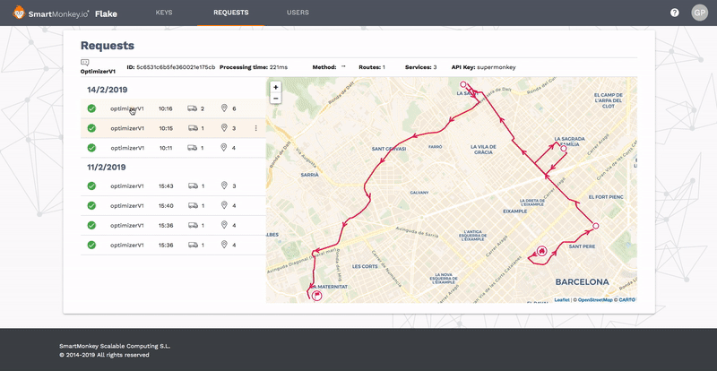

# Flake

Looking for a way to view and analyze your SmartMonkey API activity? **Flake** is a web application to check the activity of your API Keys. 

|    Product  | Description     |
|-------------|-----------------|
|    Type  | Developer application: API Key creation and request inspector. [Try it now](https://flake.smartmonkey.io) |
|    Pricing  | Free up to  See [pricing section](products/flake/pricing.md) |
|    Last update  | Release Flake 1.3 Feb 14 2019     |

**Release 1.3**

Feature:
- Api Key creation
- Request inspector New!

See the documentation about the Route optimizer on the section [Route Optimization API](/developers/optimization/README.md)