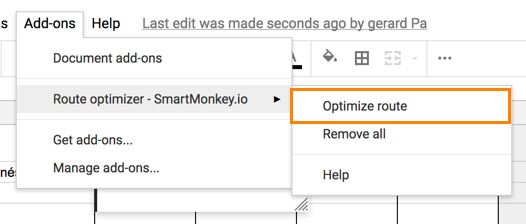

# Highway Lite

Looking for a nice and easy way to optimize your daily routes? **SmartMonkey Highway Lite - Route Optimizer** for Google Spreadsheet will save you lots of time calculating the routes. 
It’s easy, fast and reliable. 

|    Product  | Description     |
|-------------|-----------------|
|    Type  | Extension for Google Spreadsheet [Try it for free](https://gsuite.google.com/marketplace/app/smartmonkey_optimizador_de_rutas_para_go/80526361570) |
|    Pricing  | Freemium model. Free up to 10 stops and 1 vehicle.  Check below for [Upgrade license options](#How-much-does-it-cost)     |
|    Last update  | Oct 4 2018     |
 

## Last Updates ##
* Optimized routes with different depot locations and destinations. Even with just one of them. You can define each start/ending point per each vehicle.
- Google Maps integration supported. Share Google maps link for following the route on your mobile phone.

**Try Highway Lite for free**. Free to use up to 10 vehicles.
Get it on Google Suite Marketplace. 
<a href="https://gsuite.google.com/marketplace/app/smartmonkey_optimizador_de_rutas_para_go/80526361570" target="_blank" style="font: bold 18px Arial; color:white; padding: 4px 8px 4px 8px;background-color: #FF8200;font-decoration:none; margin:4px">Try it now</a>  

## Features ##
* **Address geocoder**: Add any stop address and Highway detects magically its latitude and longitude.
* **Multiple set of origins and destination** routes on each vehicle.
* **Map view**: Delivery stops are displayed on a map.
* **Time windows**: define the opening and closing times of each delivery stop to avoid visits during the closig times. 
* **Order capacity**: Define capacity of each client in weight and volume.
* **Multiple vehicle fleet**: define multiple vehicles in order to spread the visits. 
* **Fleet time windows**: Define the operating schedule of each vehicle.
* **Fleet capacity**: Define different capacities for each vehicle.
* **Real time route optimizer**:  Our technology will process all data and will show you the best route in seconds.
* **Google Maps route integration**

# User Guide #
* [Quick overview](#quick-overview) 
* [Initial setup](#initial-setup) 
* [Stops](#stops)
* [Fleet](#fleet)
* [Stop time](#stop-time)
* [Results](#results)

## Quick overview ##
This quick video demonstrates how easy it is to optimize your routes with SmartMonkey Highway Lite. Video available on [Youtube](https://www.youtube.com/watch?v=vb5sQwxtLmg).
<iframe width="560" height="315" src="https://www.youtube.com/embed/vb5sQwxtLmg" frameborder="0" allow="autoplay; encrypted-media" allowfullscreen></iframe>

## Initial Setup ##
To start using the Add-on please  install it first. Visit the [G Suite Marketplace](https://gsuite.google.com/marketplace) and look for SmartMonkey. Select the Add-on and press the button "LAUNCH". 

A new Spread Sheet opens with Highway Lite installed. 

Open the menu "Add-ons" to confirm that Highway is installed. If succesfully added, the SmartMonkey Add-on should appear on the list. 

**Granting rights for current Sheet** 
If the menu item does have only one subitem "Help", it means that the Add-on has not enough rights to start.  
Press the button "Manage Add-ons" and on the popup press the button "Manage" which will expand a menu. Select "Use in this document".
This is needed for every new Sheet you start. 

Now you should be able to see the following menu. If not, please reload the page. 

## Stops ##
Press "Optimize route" on the submenu of Highway Lite. 

When the Addon initiates it creates two tabs on the bottom: Stops and Fleet. 

The Stops Sheet is filled with sample data. Here you should fill in your stops addresses. 

On the right panel you'll find the button "Geocode" that will generate latitudes and longitudes for all the stops. 

If a Stop can not be located Highway Lite generates a new Sheet titled "Stops not found". See FAQs below for information on how to solve Geolocation issues. 

## Fleet ##
Jumping to the next Sheet "Fleet" you are asked to fill in the location of your route origin and destination. Usually it is the warehouse or office address. 

## Stop time ##
On the next step you can configure the average time needed for the stops. Default value is set to 5 minutes. 

## Results ##
After the optimization a new Sheet "Results" is created. It contains the optimized route based on all previous parameters. 

With the button "Visualize the routes on a map" you can view the route on a Google map. 
