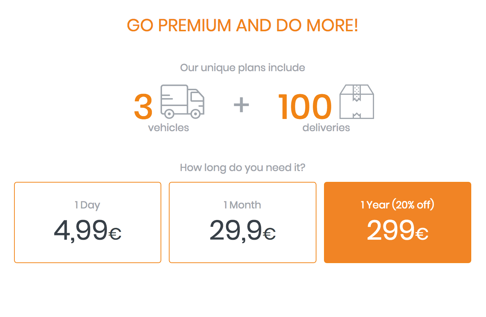

# Highway Lite Pricing

## Free plan ##
The freemium service allows you to optimize routes for **10 stops and 1 vehicle**. 
In order to increase these limits, you can upgrade your account directly on the add-on, or contact us at: sales@smartmonkey.io

Highway Lite is marketed as a freemium model. You can use it anytime for free up to 10 stops and 1 vehicle.

## Upgrade plans ##
If you need an advanced license press the button **Upgrade** to open the pricing models dialogue. Upgrade license includes 100 stops and 3 vehicles. You can decide between three options for the duration of the license:
* 1 day for just 4,99€ 
* 1 month for just 29,90€
* 1 year for just 299€

For details about how the API calculates the stops please refer to our [API documentation](developers/optimization/pricing.md)

If you have any questions or requests please contact us. 

If you add more than one vehicle or more than 100 stops, the system will display following dialogue:

Press Yes to upgrade your license. 